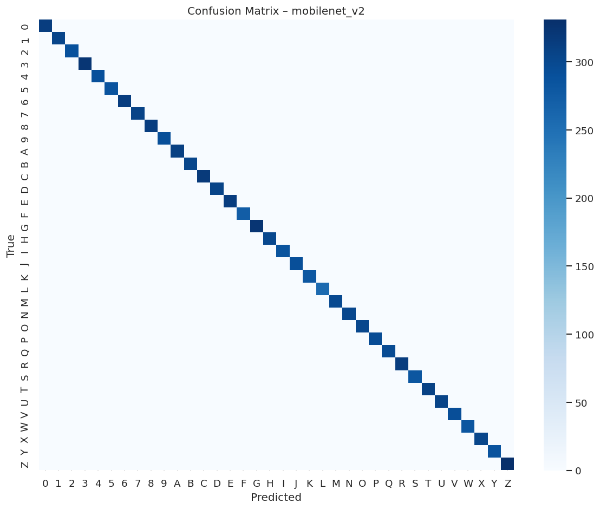
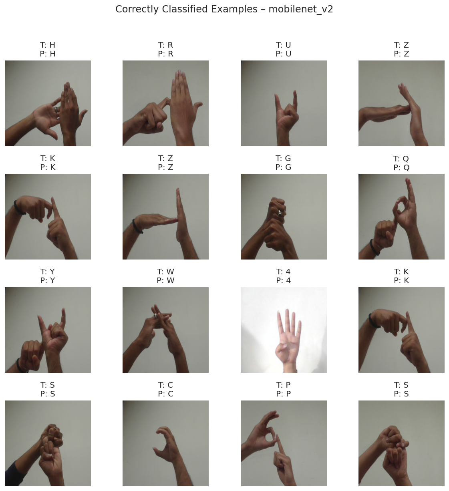

# 🤟 Indian Sign Language Classifier

A deep learning-based image classification system for recognizing **Indian Sign Language (ISL) static hand gestures** using multiple CNN architectures and transfer learning.

---

## 📌 Overview

This project focuses on building a robust and scalable model to classify **36 ISL gestures (A–Z, 0–9)** from images.  

We conducted a **comparative study of multiple deep learning architectures** under a unified pipeline and demonstrated the effectiveness of **transfer learning** in achieving near-perfect performance.

---

## 🚀 Features

- 🔤 Classifies **36 ISL classes** (Alphabets + Digits)
- 🧠 Multiple models implemented:
  - CNN (Baseline)
  - CNN + Dropout
  - ResNet18
  - MobileNetV2 ⭐ (Best Model)
  - EfficientNet-B0
  - VGG16
- 📊 Comparative performance analysis
- 🖼️ Custom dataset with **54,000 images**
- ⚡ Transfer learning for high accuracy & efficiency
- 📈 Achieved **100% validation accuracy**

---

## 🗂️ Dataset

- 📦 Total Images: **54,000**
- 📁 Classes: **36 (A–Z + 0–9)**
- 📊 Distribution: Balanced (1500 images per class)

👉 Dataset Link:  
https://www.kaggle.com/datasets/vrajesh0sharma7/sign-language

---

## 🧪 Models Used

| Model            | Type              | Accuracy |
|------------------|------------------|----------|
| CNN              | From Scratch     | 99.90%   |
| CNN + Dropout    | Regularized CNN  | 99.93%   |
| ResNet18         | Transfer Learning| 100%     |
| MobileNetV2 ⭐    | Transfer Learning| 100%     |
| EfficientNet-B0  | Transfer Learning| 100%     |
| VGG16            | Transfer Learning| 99.99%   |

---

## ⚙️ Tech Stack

- Python 🐍
- PyTorch 🔥
- Torchvision
- NumPy & Pandas
- Matplotlib & Seaborn
- Kaggle Notebooks

---

## 🧠 Methodology

1. **Data Preprocessing**
   - Resize: 224x224
   - Normalization (ImageNet stats)

2. **Data Augmentation**
   - Horizontal Flip
   - Rotation
   - Color Jitter

3. **Training Setup**
   - Optimizer: AdamW
   - Loss: Cross-Entropy with Label Smoothing
   - Scheduler: ReduceLROnPlateau

4. **Transfer Learning**
   - Pretrained models fine-tuned on ISL dataset

---

## 📊 Results

- Transfer learning models significantly outperform baseline CNNs
- MobileNetV2 provides the best trade-off between:
  - Accuracy ✅
  - Efficiency ✅

📌 Key Insight:
> Pretrained feature extractors dramatically improve performance even on domain-specific datasets like ISL.

---

## 📸 Sample Outputs

- Confusion Metrics

- Predictions from best model

---

## 🔮 Future Work

- 🎥 Dynamic gesture recognition (video-based)
- 🌍 Cross-dataset generalization
- 🧠 Transformer-based models
- 📱 Edge deployment (TensorFlow Lite / ONNX)

---

## 🤝 Contributors

- **Vrajesh Sharma**
- Yug Limbachiya
- Rudren Padsala

---

## 📚 References

- ResNet (He et al., 2016)
- MobileNetV2 (Sandler et al., 2018)
- EfficientNet (Tan & Le, 2019)
- VGG16 (Simonyan & Zisserman, 2015)

---

## 🔗 Project Links

- 💻 GitHub Repository:  
  https://github.com/Vrajesh-Sharma/Indian-Sign-Language

- 📊 Dataset (Kaggle):  
  https://www.kaggle.com/datasets/vrajesh0sharma7/sign-language

---

## ⭐ Show Your Support

If you found this project useful, consider giving it a ⭐ on GitHub!

---